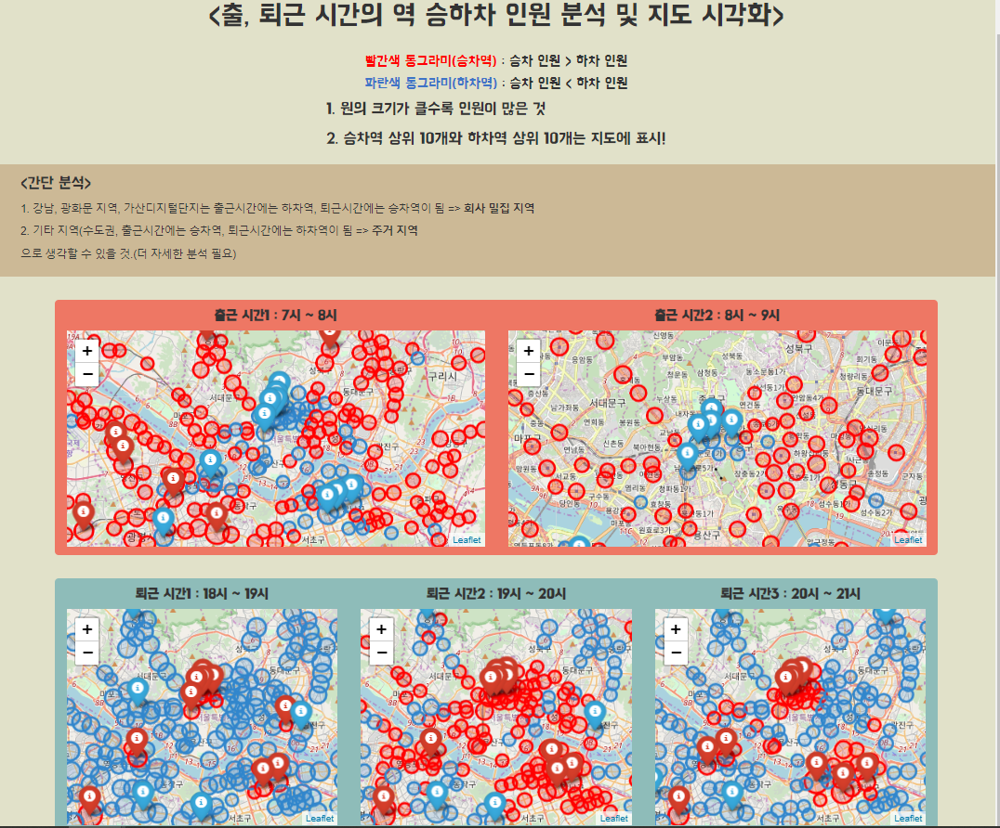

## 공공데이터 Open api를 활용한 출퇴근 시간대 지하철 사용 인원 시각화

과정

1. 서울시 제공 open api를 활용해 2017년 월별 서울 역별, 시간대별 지하철 정보를 json 형태로 수집 

2. pandas를 활용해 json 파일을 dataframe으로 변환

3. 출퇴근 시간(7 to 9시, 18 to 21시)의 승차 인원과 하차 인원 차이를 Diff 라는 파생 변수로 설정
   Diff > 0 : 승차역(빨간색)
   Diff < 0 : 하차역(파란색) 으로 분류

4. 지도에 시각화 후 웹 사이트에 표시

--------

### 웹 사이트 예시

